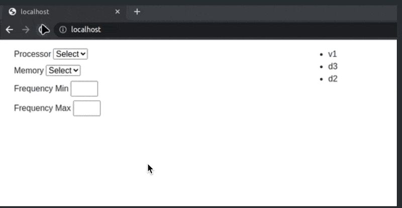

## src/application.js

The module implements a function that activates a filter based on the form inside `./index.html`.
Changing any parameter in the form filters the list of available laptops.
Laptops meeting the filtering criteria are rendered inside `

` as a `ul`/`li` list. A laptop inside `li` is the value of the `model` property inside a laptop object.
The complete list of available laptops is in the `src/index.js` file.

### Usage Example

### Logic

- if the filter is empty, the complete laptop list is displayed
- if there's no laptop meeting the criteria, an empty list is displayed
- if there's a filter applied, the list of laptops meeting the filter is displayed
- if there's more than one filter applied, the list of laptops meeting all applied criteria is displayed
